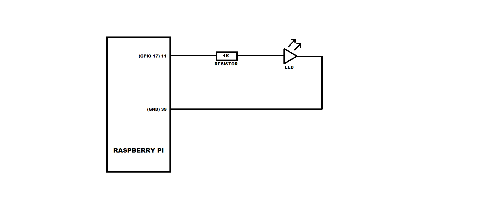

# GPIO_interfacing_RPi
#### Encouraged by <a href="https://appiko.org/">Appiko</a>

  This is a Raspberry Pi GPIO interfacing project. Here we make use of an led to make it blink.

### OBJECTIVE
 
 To blink LED.

### INTRODUCTION
  
  This is a small project to make use of Raspberry Pi to show the GPIO interfacing.
  Here we make use of a small code written to blink LED.
  
### WORKING
  
  Here I make use of python code to make the LED blink.
  I have two version of codes.One to make LED blink for a stipulated time period.
  Another is for an infinte time period.
  The circuit is set up such that is made of a resistor of 1Kohm and an LED in series such that a GPIO pin from microcontroller 
  is connected to the other pin of LED.
  
  ### INTERFACING CIRCUIT
  
  
